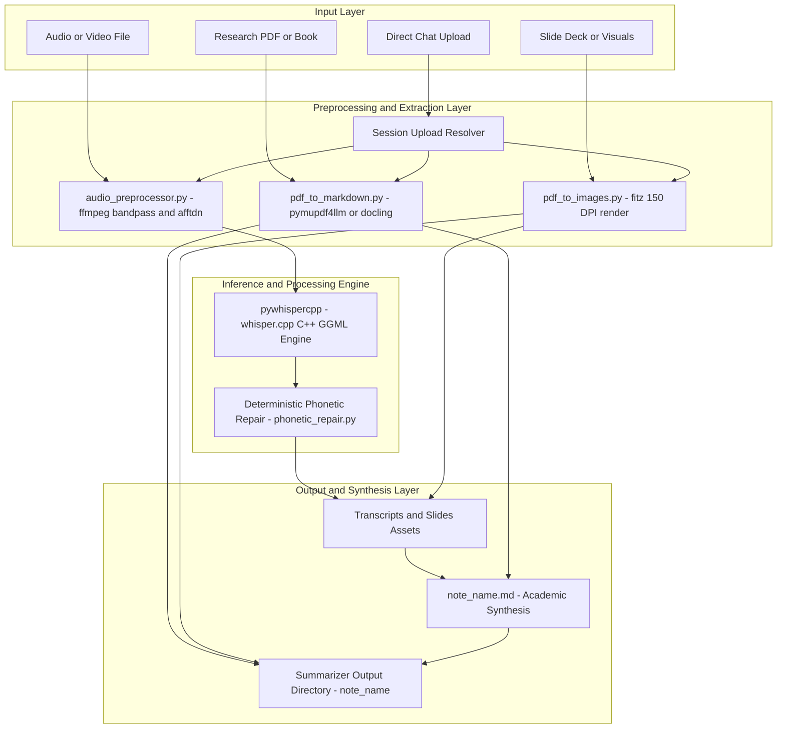
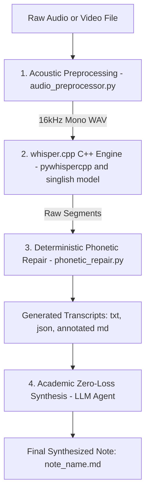
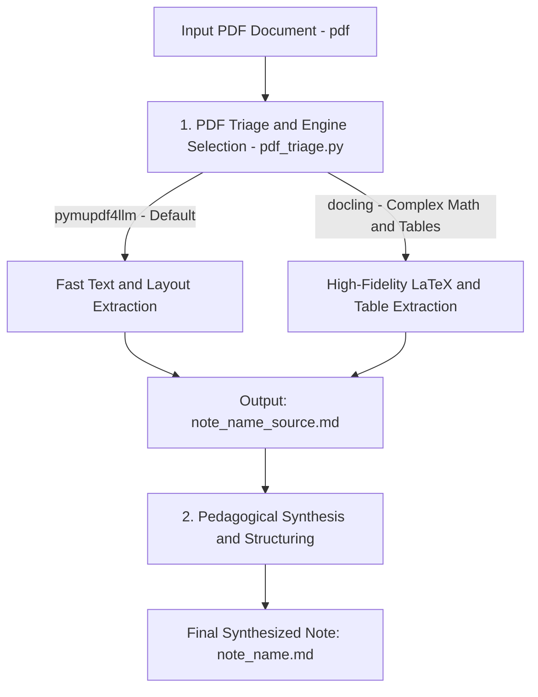
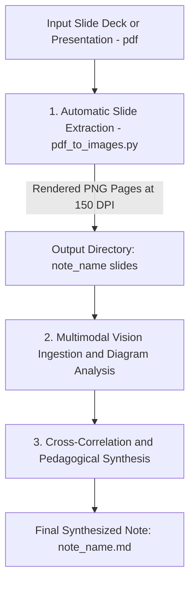

# 🎙️ Summarizer Skill

> **100% Offline, Air-Gapped, Zero-Cloud-Token Multimedia Transcription & Academic Note Synthesis**

The **Summarizer Skill** is a robust, local-first multimedia processing engine and academic note synthesizer. It converts raw audio, video recordings, research papers, technical documentation, and presentation slide decks into high-density, pedagogical study notes adhering to a strict **Zero-Information-Loss** standard.

It executes speech-to-text entirely offline via `whisper.cpp` (`pywhispercpp`) with acoustic preprocessing, Singlish/dialect priming, and deterministic phonetic repair. Document and slide workflows utilize hybrid markdown extraction (`pymupdf4llm` and `docling`) and automatic visual asset extraction (`pdf_to_images.py`), synthesizing everything into structured Markdown notes integrated with **Obsidian `[[Wikilinks]]`**.

---

## 📑 Table of Contents

- [Architecture Overview](#-architecture-overview)
- [Storage Architecture & Automatic Directory Creation](#-storage-architecture--automatic-directory-creation)
- [Direct In-Chat File Upload Handling](#-direct-in-chat-file-upload-handling)
- [The 3 Core Workflows](#-the-3-core-workflows)
  - [Workflow A: Audio/Video Transcription & Note Synthesis](#workflow-a-audiovideo-transcription--note-synthesis)
  - [Workflow B: Research Papers / Technical Documentation / Reference Books](#workflow-b-research-papers--technical-documentation--reference-books)
  - [Workflow C: Presentation Slide Decks / Flowcharts / Visual Materials](#workflow-c-presentation-slide-decks--flowcharts--visual-materials)
- [System Requirements & Prerequisites](#-system-requirements--prerequisites)
  - [1. Operating System & Native Toolchains](#1-operating-system--native-toolchain-prerequisites)
  - [2. Python Version Requirements](#2-python-version-requirements)
  - [3. Audio Engine & FFmpeg Architecture](#3-audio-engine--ffmpeg-architecture-no-system-ffmpeg-needed)
  - [4. Core Python Dependencies](#4-core-python-dependencies-matrix)
- [Step-by-Step Installation & Setup](#-step-by-step-installation--setup)
  - [Step 1: Navigate to the Skill Directory](#step-1-navigate-to-the-skill-directory)
  - [Step 2: Create & Activate Virtual Environment](#step-2-create--activate-virtual-environment-recommended)
  - [Step 3: Install Python Dependencies](#step-3-install-python-dependencies)
  - [Step 4: Verify Environment Readiness](#step-4-verify-environment-readiness-single-command)
- [First-Run Setup & Model Caching](#-first-run-setup--model-caching)
  - [Automatic Hugging Face Model Download](#automatic-hugging-face-model-download)
  - [Air-Gapped & Offline Setup Instructions](#air-gapped--offline-setup-instructions)
- [CLI Reference & Script Execution](#-cli-reference--script-execution)
- [Academic Note Standard & Structure](#-academic-note-standard--structure)
- [Troubleshooting & FAQ](#-troubleshooting--faq)

---

## 🏛️ Architecture Overview

The Summarizer Skill is engineered around a modular, local-first processing architecture that isolates heavy computational workloads (audio transcoding, C++ GGML inference, PDF layout analysis, and image rendering) into specialized Python helper scripts executed locally.



- **Zero Cloud Data Exposure**: All inference and processing run locally on CPU/GPU via C++ bindings (`pywhispercpp`). No audio streams or sensitive documents are transmitted to third-party APIs.
- **Cross-Platform Portability**: Works out-of-the-box on Windows, macOS, and Linux with zero manual path setup.

---

## 📁 Storage Architecture & Automatic Directory Creation

All generated assets and summary notes are saved to a dynamically resolved, cross-platform base directory:

- **Default Base Folder**: `~/Desktop/Summarizer/`  
  - Automatically created via `Path(base_dir).mkdir(parents=True, exist_ok=True)`, ensuring that the desktop directory itself is initialized if it does not already exist.
  - **Windows**: `C:\Users\<Username>\Desktop\Summarizer\`
  - **macOS / Linux**: `~/Desktop/Summarizer/`

For each processing run, a dedicated subfolder is automatically created, named after the note stem or `--note-name`:

```
~/Desktop/Summarizer/
└── <note_name>/                        # Run-specific output folder (e.g. LPS_Week_04/)
    ├── <note_name>.md                  # Zero-information-loss academic synthesis note
    ├── <note_name>_source.md           # (For PDFs) Extracted raw source markdown
    ├── <note_name>_transcript.txt      # Timestamped text transcript with dialogue
    ├── <note_name>_transcript.json     # Structured JSON with timestamps & segments
    ├── <note_name>_transcript_annotated.md # Grouped dialogue blocks with time headers
    └── slides/                         # Extracted slide images (PNG)
        ├── <note_name>_page_001.png
        ├── <note_name>_page_002.png
        └── ...
```

---

## 📎 Direct In-Chat File Upload Handling

When users upload audio, video, or PDF files directly into the chat interface, the skill automatically detects and resolves session upload paths on disk (e.g., from temporary staging directories). 
- The file path is captured and mapped into the local runner scripts.
- The pipeline automatically extracts the file stem as the `<note_name>` unless overridden by `--note-name`.
- Outputs are correctly routed into `~/Desktop/Summarizer/<note_name>/`.

---

## 🔄 The 3 Core Workflows

### Workflow A: Audio/Video Transcription & Note Synthesis

**Use Case**: Converting lecture recordings, seminar videos, meeting audio, or viva presentations (`.m4a`, `.mp3`, `.wav`, `.mp4`, `.mkv`, `.webm`) into searchable transcripts and structured study notes.



#### Step-by-Step Execution:
1. **Acoustic Preprocessing (`audio_preprocessor.py` + `ffmpeg`)**:
   - Converts audio to 16 kHz mono 16-bit PCM WAV.
   - Applies a **Bandpass Filter** (100 Hz – 7,500 Hz) to isolate vocal frequencies and remove HVAC rumble or mic hiss.
   - Applies **Adaptive Noise Reduction (`afftdn`)** (`-25 dB` noise floor) to eliminate ambient room hum.
   - Applies **Dynamic Audio Normalization (`dynaudnorm`)** to balance soft speaker tones and sudden volume spikes.
2. **Offline C++ Transcription (`pywhispercpp`)**:
   - Loads the quantized GGUF model: `mjwong/whisper-large-v3-turbo-singlish`.
   - Uses multi-threaded CPU execution (default 8 threads).
   - Primes decoding with Singapore academic and technical context (colloquial particles like `lah`, `leh`, and domain terms).
3. **Deterministic Phonetic Repair (`phonetic_repair.py`)**:
   - Removes Whisper hallucination loops and phantom noise markers.
   - Corrects common acoustic misrecognitions via regex rules:
     - `clock / crop 3.5` ➔ `Claude 3.5`
     - `Germany` ➔ `Gemini`
     - `ostidian` ➔ `Obsidian`
     - `ECOC` ➔ `INCOSE`
     - `NRMI` ➔ `NRMD` (*Needs and Requirements Manual*)
     - `apologetic memory` ➔ `agentic memory`
4. **Academic Synthesis**:
   - Ingests `<note_name>_transcript_annotated.md`.
   - Structures content into chronological chapters with `[MM:SS]` markers, core definitions, exam warnings, and viva defense traps.
   - Injects Obsidian `[[Wikilinks]]`.

---

### Workflow B: Research Papers / Technical Documentation / Reference Books

**Use Case**: Processing dense academic papers, specifications, books, or technical manuals (`.pdf`) into clean source markdown and comprehensive study notes.



#### Step-by-Step Execution:
1. **PDF Triage & Markdown Extraction (`pdf_to_markdown.py`)**:
   - **`pymupdf4llm` (Default)**: Lightning-fast Markdown extraction optimized for text-heavy reports and technical documentation.
   - **`docling`**: High-fidelity extraction engine invoked for documents containing complex multi-column layouts, nested tables, and LaTeX math formulas.
   - Saves the extracted raw text to `<base_dir>/<note_name>/<note_name>_source.md`.
2. **Pedagogical Synthesis**:
   - The agent parses `<note_name>_source.md`, extracting core methodology, foundational premises, architectural trade-offs, and actionable insights.
   - Generates the final synthesized study note at `<base_dir>/<note_name>/<note_name>.md` with Obsidian `[[Wikilinks]]`.

---

### Workflow C: Presentation Slide Decks / Flowcharts / Visual Materials

**Use Case**: Processing presentation slides, lecture slide decks, or flowchart-heavy diagrams (`.pdf`) into extracted visual assets and multimodal summary notes.

> **AUTOMATIC SLIDE EXTRACTION RULE**: Whenever a PDF slide deck or visual presentation is provided (via file path or direct upload), the summarizer skill **ALWAYS automatically extracts and saves slide images into `~/Desktop/Summarizer/<note_name>/slides/` by default** using `pdf_to_images.py`.



#### Step-by-Step Execution:
1. **Automatic Slide Extraction (`pdf_to_images.py`)**:
   - Uses `PyMuPDF` (`fitz`) to render every page of the presentation into a high-resolution PNG image at `150 DPI` (configurable).
   - Automatically provisions `<base_dir>/<note_name>/slides/`.
   - Names files systematically: `<note_name>_page_001.png`, `<note_name>_page_002.png`, etc.
2. **Multimodal Vision Ingestion**:
   - Inspects rendered slide images for architectural diagrams, 2x2 matrices, flowcharts, code snippets, and mathematical formulas.
   - Bypasses limitations of plain text PDF scraping (such as broken text order or unindexed graphic elements).
3. **Combined Audio + Slide Mode**:
   - When both a lecture recording (Workflow A) and slide deck (Workflow C) are provided, the agent correlates slide page numbers with audio timestamps `[MM:SS]` in the chronological breakdown.
4. **Output Generation**:
   - Writes the completed note to `<base_dir>/<note_name>/<note_name>.md` with embedded slide image references and Obsidian `[[Wikilinks]]`.

---

## 💻 System Requirements & Prerequisites

### 1. Operating System & Native Toolchain Prerequisites
The Summarizer Skill runs natively on Windows, macOS, and Linux. Ensure your operating system satisfies the toolchain prerequisites:

- **Windows (10 / 11, 64-bit)**:
  - **Microsoft Visual C++ 2015–2022 Redistributable (x64)** is required at runtime for the C++ GGML Whisper engine bindings (`pywhispercpp`) and PyMuPDF binaries.
    - 👉 **Direct Download**: [Microsoft Visual C++ 2015–2022 Redistributable (x64)](https://aka.ms/vs/17/release/vc_redist.x64.exe)
  - *(Optional)* If compiling `pywhispercpp` from source rather than using a pre-built wheel, install [Visual Studio Build Tools](https://visualstudio.microsoft.com/visual-cpp-build-tools/) with the *"Desktop development with C++"* workload selected.
- **macOS (Apple Silicon & Intel)**:
  - **Apple Silicon (M1 / M2 / M3 / M4)**:
    - Install Xcode Command Line Tools:
      ```bash
      xcode-select --install
      ```
    - Pre-compiled ARM64 wheels are supported out-of-the-box.
  - **Intel Macs (x86_64)**:
    - Install Xcode Command Line Tools:
      ```bash
      xcode-select --install
      ```
    - Install `cmake` via Homebrew (required for compiling/linking C++ GGML bindings on Intel macOS):
      ```bash
      brew install cmake
      ```
- **Linux (Ubuntu / Debian / Fedora / Arch)**:
  - Requires **glibc >= 2.27** (default on Ubuntu 18.04 LTS and newer).
  - Install standard build toolchains (if wheels require compilation or building from source):
    - **Ubuntu / Debian**:
      ```bash
      sudo apt update && sudo apt install -y build-essential cmake
      ```
    - **Fedora / RHEL**:
      ```bash
      sudo dnf groupinstall "Development Tools" && sudo dnf install -y cmake
      ```
    - **Arch Linux**:
      ```bash
      sudo pacman -S base-devel cmake
      ```

### 2. Python Version Requirements
- **Recommended**: **Python 3.10 – 3.12 (64-bit)**.
- ⚠️ **Python 3.9 is Strictly Unsupported**:
  - `docling` (IBM deep layout analysis engine) and modern `pymupdf4llm` require **Python >= 3.10**. Python 3.9 will fail during dependency resolution due to modern Pydantic v2 and typing constraints.
- ⚠️ **Python 3.13 Notice**:
  - Python 3.13 is currently not recommended because pre-compiled binary wheels for C++ extensions (`pywhispercpp`, `scipy`, `torch`) may not yet be available across all platforms. Stick to **Python 3.10 – 3.12**.

### 3. Audio Engine & FFmpeg Architecture (No System FFmpeg Needed!)
> [!IMPORTANT]
> **You do NOT need to install FFmpeg on your operating system or configure system PATH.**

The Summarizer Skill uses `imageio-ffmpeg`, which bundles self-contained, pre-compiled static FFmpeg binaries for Windows, macOS, and Linux.
- **Static Binary Bundled**: Contains complete audio filter graph support (`highpass`, `lowpass`, `afftdn`, `dynaudnorm`).
- **Acoustic Preprocessing**: Both `audio_preprocessor.py` and `transcribe.py` automatically detect the bundled binary via `imageio_ffmpeg.get_ffmpeg_exe()`, providing zero-configuration acoustic filtering and normalization out-of-the-box.

### 4. Core Python Dependencies Matrix
All core requirements are tracked in `requirements.txt` (and `scripts/requirements.txt`):

| Package | Version | Purpose |
| :--- | :--- | :--- |
| `pywhispercpp` | `>=1.2.0` | High-performance C++ GGML bindings for whisper.cpp (offline STT) |
| `imageio-ffmpeg` | `>=0.5.0` | Bundled static FFmpeg binaries with speech filtering support |
| `huggingface-hub` | `>=0.20.0` | Automatic model downloading and local caching |
| `PyMuPDF` | `>=1.23.0` | High-resolution PDF slide extraction (`fitz`) at 150 DPI |
| `pymupdf4llm` | `>=0.1.0` | Fast, lightweight PDF-to-Markdown document parsing |
| `docling` | `>=1.0.0` | Deep document layout parsing for complex tables and LaTeX formulas |
| `scipy` | `>=1.10.0` | Signal processing and audio frequency calculations |
| `numpy` | `>=1.24.0` | Array manipulation for audio buffers and image matrices |
| `tabulate` | `>=0.9.0` | Formatted terminal tables for PDF triage analysis |

---

## 🛠️ Step-by-Step Installation & Setup

### Step 1: Navigate to the Skill Directory
Navigate to the skill root directory in your terminal:

```powershell
# Windows (PowerShell)
cd "$HOME\.gemini\config\skills\summarizer"

# Windows (Command Prompt)
cd "%USERPROFILE%\.gemini\config\skills\summarizer"
```
```bash
# macOS / Linux
cd ~/.gemini/config/skills/summarizer
```

### Step 2: Create & Activate Virtual Environment (Recommended)
Isolating dependencies inside a dedicated virtual environment prevents package conflicts:

- **Windows (PowerShell)**:
  ```powershell
  python -m venv .venv
  .\.venv\Scripts\Activate.ps1
  ```
  *(If script execution is disabled in PowerShell, run `Set-ExecutionPolicy -Scope Process -ExecutionPolicy Bypass` first).*

- **Windows (Command Prompt)**:
  ```cmd
  python -m venv .venv
  .\.venv\Scripts\activate.bat
  ```

- **macOS / Linux**:
  ```bash
  python3 -m venv .venv
  source .venv/bin/activate
  ```

### Step 3: Install Python Dependencies
Upgrade `pip` and install all required packages:

```bash
python -m pip install --upgrade pip
pip install -r requirements.txt
```

> [!TIP]
> **Ultra-Fast Alternative (`uv`)**: If you have `uv` installed, run:
> ```bash
> uv pip install -r requirements.txt
> ```

### Step 4: Verify Environment Readiness (Single Command)
Run this single-line verification command in your terminal to validate all dependencies, C++ bindings, and FFmpeg integration:

```bash
python -c "import pywhispercpp, imageio_ffmpeg, huggingface_hub, pymupdf, pymupdf4llm, docling; print('\n[SUCCESS] Summarizer Environment: All dependencies verified & READY!\n[FFmpeg Binary]:', imageio_ffmpeg.get_ffmpeg_exe())"
```

If the command prints `[SUCCESS] Summarizer Environment: All dependencies verified & READY!` along with the detected FFmpeg binary path, your setup is complete!

---

## 🌐 First-Run Setup & Model Caching

### Automatic Hugging Face Model Download
The speech-to-text pipeline defaults to the quantized GGUF model:
- **Repository**: [`mjwong/whisper-large-v3-turbo-singlish`](https://huggingface.co/mjwong/whisper-large-v3-turbo-singlish)
- **Model Size**: ~1.6 GB (quantized GGUF binary)

When you execute `transcribe.py` for the first time while connected to the internet, `huggingface_hub` automatically downloads the model weights and stores them in your global user cache:
- **Windows**: `C:\Users\<Username>\.cache\huggingface\hub\models--mjwong--whisper-large-v3-turbo-singlish\`
- **macOS / Linux**: `~/.cache/huggingface/hub/models--mjwong--whisper-large-v3-turbo-singlish/`

Subsequent runs detect the cached weights immediately and execute **100% offline with zero cloud tokens or internet access**.

### Air-Gapped & Offline Setup Instructions
For enterprise environments, classified networks, or air-gapped workstations without internet access, follow these instructions to pre-stage model weights:

#### Option A: Pre-Download on a Connected Machine & Transfer Cache
1. On an internet-connected computer with Python and `huggingface-hub` installed, download the model weights:
   ```bash
   python -c "from huggingface_hub import snapshot_download; print('Cached to:', snapshot_download(repo_id='mjwong/whisper-large-v3-turbo-singlish'))"
   ```
2. Copy the resulting cache directory to the air-gapped machine:
   - Copy `~/.cache/huggingface/hub/models--mjwong--whisper-large-v3-turbo-singlish/`
   - Place it into the same user cache path on the target machine (`~/.cache/huggingface/hub/`).

#### Option B: Direct GGUF Binary Transfer & CLI Path Flag
1. Download the standalone model file `ggml-model.bin` directly:
   ```bash
   python -c "from huggingface_hub import hf_hub_download; print('File downloaded to:', hf_hub_download(repo_id='mjwong/whisper-large-v3-turbo-singlish', filename='ggml-model.bin'))"
   ```
2. Transfer `ggml-model.bin` via USB or secure transfer to any local folder on the air-gapped machine (e.g. `C:\models\ggml-model.bin` or `/opt/models/ggml-model.bin`).
3. Run `transcribe.py` by supplying the direct file path to the `--model` flag:
   ```powershell
   python scripts/transcribe.py "recording.m4a" --model "C:\models\ggml-model.bin" --note-name "Lecture_Offline"
   ```

*(Optional for Docling in Air-Gapped Setups)*: If you plan to use `docling` on an air-gapped machine for complex LaTeX/tables, run a one-time test conversion online (`python scripts/pdf_to_markdown.py sample.pdf --engine docling`) to pre-cache layout models into `~/.cache/docling/`, then transfer that directory to the air-gapped machine.

---

## 🚀 CLI Reference & Script Execution

All standalone execution scripts reside in `scripts/`:

### 1. `transcribe.py` (Full Audio Transcription Pipeline)
```powershell
python scripts/transcribe.py "path\to\recording.m4a" --note-name "Lecture_01" --threads 8 --singlish --enhance-audio
```
* **Key Flags**: `--model`, `--threads`, `--singlish`, `--enhance-audio`, `--no-phonetic-repair`, `--language`, `--keep-wav`.

### 2. `pdf_triage.py` (PDF Triage & Engine Selector)
```powershell
python scripts/pdf_triage.py "path\to\document.pdf"
```

### 3. `pdf_to_markdown.py` (Hybrid PDF Markdown Extraction)
```powershell
# Using fast default pymupdf4llm:
python scripts/pdf_to_markdown.py "path\to\doc.pdf" --engine pymupdf4llm --note-name "Doc"

# Using high-fidelity docling for LaTeX/tables:
python scripts/pdf_to_markdown.py "path\to\doc.pdf" --engine docling --note-name "Doc"
```

### 4. `pdf_to_images.py` (Slide Image Extraction)
```powershell
python scripts/pdf_to_images.py "path\to\slides.pdf" --note-name "Lecture_01" --dpi 150
```

### 5. `audio_preprocessor.py` (Standalone Acoustic Filtering)
```powershell
python scripts/audio_preprocessor.py "input.mp3" --output "clean.wav" --highpass 100 --lowpass 7500
```

### 6. `phonetic_repair.py` (Standalone Lexicon Repair)
```powershell
python scripts/phonetic_repair.py "C:\Users\User\Desktop\Summarizer\Lecture_01\Lecture_01_transcript.txt"
```

---

## 📝 Academic Note Standard & Structure

1. **Zero Raw Transcript Dumps**: Uncurated transcript blocks are strictly prohibited in study notes.
2. **ADHD-Friendly Formatting**: Bottom-line takeaway first, short paragraphs (2–3 sentences max), bullet points, and bold anchors.
3. **No AI Clichés ("No AI Slop")**: Forbidden words include *"delve"*, *"tapestry"*, *"testament"*, *"furthermore"*, *"moreover"*.
4. **Pedagogical Nuance**: Capture professor warnings, grading rubrics, and viva defense traps.
5. **Obsidian `[[Wikilinks]]`**: Wrap technical terms in double brackets (e.g. `[[INCOSE]]`, `[[Claude 3.5]]`, `[[Obsidian]]`).
6. **No Pipeline Metadata**: Exclude Whisper model or ffmpeg technicalities from final study notes.

---

## ❓ Troubleshooting & FAQ

- **Q1: `ffmpeg executable not found` error?**  
  - Ensure `imageio-ffmpeg` is installed: `pip install imageio-ffmpeg`. If using a virtual environment, ensure it is activated before running scripts. You do not need to install system-level FFmpeg.
- **Q2: `ImportError: DLL load failed while importing _pywhispercpp` on Windows?**  
  - This indicates the Microsoft C++ runtime is missing. Install the [Microsoft Visual C++ 2015–2022 Redistributable (x64)](https://aka.ms/vs/17/release/vc_redist.x64.exe) and restart your terminal.
- **Q3: `pip` dependency resolution failure or wheel build failure on Python 3.9?**  
  - Python 3.9 is **unsupported** due to modern upstream dependencies in `docling` and `pymupdf4llm`. Upgrade to Python 3.10, 3.11, or 3.12 (64-bit).
- **Q4: How do I run transcription in an offline or air-gapped network?**  
  - Download `ggml-model.bin` (~1.6 GB) from Hugging Face on a connected machine, copy it to the target system, and pass `--model "path/to/ggml-model.bin"` to `transcribe.py`.
- **Q5: How do I change the default output destination?**  
  - By default, files are saved to `~/Desktop/Summarizer/<note_name>/`. Pass `--base-dir <path>` or `--output-dir <path>` to any CLI script to override the destination.
- **Q6: How do I add custom domain terms or phonetic repair rules?**  
  - Edit `scripts/phonetic_repair.py` and append regex substitution patterns to `PHONETIC_REPAIR_RULES`.
- **Q7: Permission error activating `.venv` on Windows PowerShell?**  
  - Run `Set-ExecutionPolicy -Scope Process -ExecutionPolicy Bypass` in your PowerShell window, then reactivate `.\.venv\Scripts\Activate.ps1`.

---
